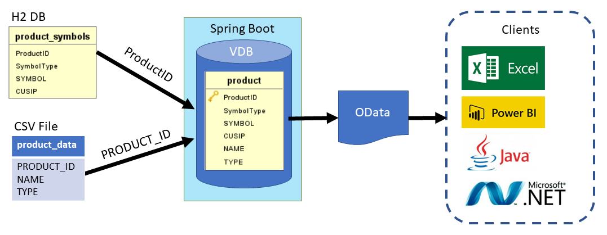

# Demo Project of Teiid Spring Boot

## Overview

The project demostrated how to use [Teiid Spring Boot](https://github.com/teiid/teiid-spring-boot) runtime on joining `product_symbols` table of H2 database and `product_data.csv` file with `productId` column and then created a `product` view. The `product` view then exposed as OData API that can be accessed by clients such as Excel, PowerBI, Java application, .Net application, etc.

## Coding Steps
The demo project created with the following steps:
1. Add `org.teiid:teiid-spring-boot-starter`, `org.teiid:spring-odata` and `com.h2database:h2` dependencies into [build.gradle](build.gradle).
2. Create the [DataSources.java](src/main/java/org/teiid/springboot/demo/DataSources.java), the data source name and method name must be the same. In the project, it is `symbols`.
3. Add data source `spring.datasource.symbols` related configurations to [application.properties](src/main/resources/application.properties) file. The `spring.teiid.model.package` configured the root package for class scanning and the `spring.teiid.file.parent-directory` configured the directory path of the [product_data.csv](src/main/resources/product_data.csv) file. The [schema-symbols.sql](src/main/resources/schema-symbols.sql) and [data-symbols.sql](src/main/resources/data-symbols.sql) file is to create table and load data to the H2 database, these two files are optional in production environment.
4. Create the `product` view with [Product.java](src/main/java/org/teiid/springboot/demo/Product.java) and the optional [ProductRepository.java](src/main/java/org/teiid/springboot/demo/ProductRepository.java) to be used by other Java classes for data retrieval.


## Execution
Execute the following command to run the project locally:
```
gradlew bootRun
```

Access the OData endpoint with the following URL:
```
http://localhost:8080/odata/product?$format=json
```
